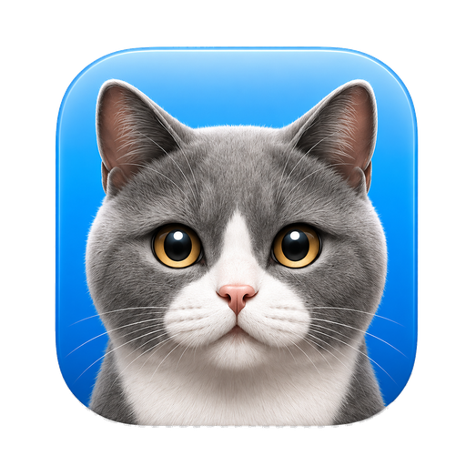

<p align="center">
  
</p>

# Murrly

**Murrly** (он же **Murly** / **Мурли**) — локальное приложение для голосового
ввода текста на Linux и macOS (Apple Silicon): push-to-talk диктовка и
распознавание речи (speech-to-text). Удерживаете `F12`, говорите, отпускаете
клавишу — распознанный текст вставляется в активное окно через буфер обмена.
Написано на Go, работает офлайн через `whisper.cpp`; аудио не отправляется во
внешние сервисы.

Murrly is an offline, push-to-talk voice typing and dictation app for Linux and
macOS. It does local speech-to-text / speech recognition with `whisper.cpp`,
is written in Go, and never sends your audio to the cloud.

## Возможности

- глобальная клавиша push-to-talk;
- распознавание речи через локальную модель Whisper;
- вставка результата в текущее окно через `xclip` + `xdotool` (Linux) или
  нативный NSPasteboard + CGEventPost Cmd+V (macOS);
- **полное сохранение clipboard на macOS** — скопированная картинка
  переживает транскрипцию;
- иконка и меню в системном трее (macOS: дополнительно правый клик
  на иконке в Dock);
- **полупрозрачный overlay поверх экрана на macOS** во время записи
  и распознавания (компенсирует notch скрывающий tray-иконку);
- три модели Whisper на выбор прямо из меню (large-v3 / turbo / turbo-q5_0),
  переключение **без рестарта** (hot-swap);
- toggle "Запускать при логине" из меню (Login Item на macOS, XDG
  autostart на Linux);
- копирование последних трёх распознанных фрагментов из меню;
- постобработка текста: пробелы после пунктуации, удаление типичных
  hallucination-фраз Whisper вроде `Продолжение следует...`,
  `Субтитры сделал ...`, `В этом видео я покажу ...`;
- конфиг в TOML.

## Ограничения

- Linux: рассчитано на X11. Для Wayland глобальный hotkey, `xclip` и `xdotool`
  могут не работать.
- macOS: требуется Apple Silicon (M1+) и macOS 11+. Intel Mac не проверен.
- сборка использует CUDA на Linux и Metal на macOS;
- модель Whisper не хранится в репозитории и скачивается отдельно.

## Быстрый старт на Debian/Ubuntu

```bash
git clone https://github.com/tertiumorganum1/murrly.git
cd murrly
scripts/bootstrap-ubuntu.sh
```

Скрипт:

- ставит системные зависимости через `sudo apt-get`;
- собирает `whisper.cpp`;
- скачивает модель `ggml-large-v3.bin`;
- копирует модель в `~/.local/share/murrly/models/`;
- собирает бинарник `bin/murrly`;
- устанавливает приложение в `~/.local/bin/murrly`;
- добавляет ярлык в меню приложений.

После установки запустите приложение из меню или командой фонового запуска:

```bash
make start
```

`make start` запускает приложение в фоне. Терминал после этого можно закрыть;
управление остается через иконку в трее.

Если CUDA toolkit не установлен, можно разрешить скрипту поставить пакет из
репозитория дистрибутива:

```bash
INSTALL_CUDA_TOOLKIT=1 scripts/bootstrap-ubuntu.sh
```

Чтобы включить автозапуск при входе в графическую сессию:

```bash
AUTOSTART=1 scripts/bootstrap-ubuntu.sh
```

Можно выбрать другую модель:

```bash
MODEL=large-v3-turbo scripts/bootstrap-ubuntu.sh
```

## Быстрый старт на macOS (Apple Silicon)

```bash
git clone https://github.com/tertiumorganum1/murrly.git
cd murrly
scripts/bootstrap-mac.sh
```

Скрипт:

- ставит системные зависимости через Homebrew (`brew install cmake portaudio go librsvg`);
- собирает `whisper.cpp` с Metal-ускорением;
- скачивает модель `ggml-large-v3.bin`;
- копирует модель в `~/Library/Application Support/Murrly/models/`;
- собирает бинарник `bin/murrly`;
- генерит иконку `build/murrly.icns`;
- упаковывает `.app` bundle и копирует в `/Applications/Murrly.app` (ad-hoc подпись).

Запуск:

```bash
open -a Murrly
```

или через Spotlight (`Cmd+Space`, ввести `Murrly`).

### Первый запуск на macOS

1. **Gatekeeper.** Приложение подписано ad-hoc (не Apple Developer ID), поэтому
   при первом запуске появится предупреждение "Murrly cannot be opened because
   it is from an unidentified developer". Кликните по `/Applications/Murrly.app`
   правой кнопкой → `Open` → `Open` в диалоге. Со второго раза приложение
   запускается без предупреждений.

2. **Микрофон.** При первом удержании hotkey macOS покажет диалог "Murrly would
   like to access the microphone". Разрешите. Текст диалога определяется
   `NSMicrophoneUsageDescription` в Info.plist.

3. **Accessibility.** Для вставки текста через `Cmd+V` нужно разрешение
   Accessibility. На старте Murrly триггерит системный prompt; если пропустили,
   откройте `System Settings → Privacy & Security → Accessibility` и включите
   тумблер для Murrly. После этого перезапустите приложение.

### Hotkey на macOS

По умолчанию `F12` на современных Mac занят медиа-контролом (Volume Up).
Варианты:

- держать `fn+F12` вместо `F12`;
- включить `System Settings → Keyboard → Use F1, F2 etc. keys as standard
  function keys` (тогда `F12` без `fn`);
- выбрать другую клавишу в конфиге.

Поддерживаются `F1`..`F15`. Конфиг:
`~/Library/Application Support/Murrly/config.toml`

```toml
[hotkey]
key = "F10"
```

### Меню (macOS)

**Правый клик на иконке Murrly в Dock** даёт меню:

- три последние транскрипции (превью, клик копирует в clipboard);
- **Модель ▶** — submenu с тремя моделями Whisper. Переключение
  применяется на лету (hot-swap, без рестарта приложения),
  выбранная модель сохраняется в `config.toml`;
- **Запускать при логине** — toggle с галочкой, ставит/убирает
  Murrly из Login Items;
- Открыть конфиг;
- Завершить Murrly.

То же меню доступно через tray-иконку (если она видна — иногда
прячется за вырезом дисплея на M-серии).

### Overlay на macOS

Полупрозрачный pill сверху экрана показывает состояние:

- 🎤 Listening… — пока удерживаете hotkey;
- ⚙ Transcribing… — пока Whisper обрабатывает;
- ⚠ Error — что-то пошло не так.

Нужен потому что tray-иконка на M1 Pro/Max часто скрыта за notch.

### Сохранение clipboard

Murrly использует clipboard для вставки распознанного текста (Set →
Cmd+V → Restore). На macOS реализовано через нативный NSPasteboard
с полным snapshot всех типов: **скопированная картинка, файл, RTF,
любые другие данные** возвращаются в clipboard ровно как были до
транскрипции.

### Автозапуск на macOS

Через меню (см. выше) или из CLI:

```bash
make autostart
```

Под капотом — Login Item, добавляется через `osascript`. Удалить:

```bash
make uninstall-autostart
```

### Логи на macOS

```bash
tail -f ~/Library/Caches/Murrly/Murrly.log
```

Если что-то с clipboard сломалось, подробный лог clipboard-уровня
через unified log:

```bash
log stream --predicate 'subsystem == "com.tertiumorganum1.murrly"' --info
```

### Несколько моделей сразу (опционально)

По умолчанию `bootstrap-mac.sh` качает одну модель (`MODEL=large-v3`).
Чтобы скачать все три варианта и переключаться между ними из меню без
дополнительного `make model`:

```bash
MODELS=all scripts/bootstrap-mac.sh
```

То же на Linux:

```bash
MODELS=all scripts/bootstrap-ubuntu.sh
```

## Ручная сборка

```bash
make whisper
make model
make build
```

`Makefile` определяет ОС через `uname -s` и подключает `mk/linux.mk` или
`mk/darwin.mk` соответственно.

Установка бинарника, ярлыка приложения и локально скачанных моделей (Linux):

```bash
make install
```

Если была установлена старая версия как user-service, `make install` отключит
ее и уберет старый unit-файл.

На macOS — то же самое, но собирает и устанавливает `.app` bundle:

```bash
make install
```

### Запуск (Linux)

```bash
make start
```

`make start` не привязывает процесс к текущему терминалу. Если закрыть консоль,
`murrly` продолжит работать, пока вы не закроете его через меню в трее.

Приложение работает как обычный tray-app. В трее есть меню, через которое его
можно закрыть. Там же — пункты для копирования последних трех распознанных
фрагментов в буфер обмена.

Автозапуск:

```bash
make autostart
```

Отключить автозапуск:

```bash
make uninstall-autostart
```

Лог приложения (Linux):

```text
~/.cache/murrly/murrly.log
```

Лог ротируется по 5 MiB, хранится до 5 backup-файлов.

## Конфигурация

При первом запуске создается файл:

- Linux: `~/.config/murrly/config.toml`
- macOS: `~/Library/Application Support/Murrly/config.toml`

Пример:

```toml
[hotkey]
key = "F12"
mode = "push_to_talk"

[audio]
device = ""
sample_rate = 16000

[whisper]
model_path = ""  # пустая строка = дефолт (см. ниже)
language = ""
beam_size = 5
initial_prompt = """
Мы обсуждаем программирование и архитектуру: React, TypeScript,
Docker, Kubernetes, microservices, middleware, observability.
"""

[output]
paste_delay_ms = 80
restore_primary = true
```

`model_path = ""` — Murrly резолвит путь автоматически:
- Linux: `~/.local/share/murrly/models/ggml-large-v3.bin`
- macOS: `~/Library/Application Support/Murrly/models/ggml-large-v3.bin`

`language = ""` означает автоопределение языка. Для русской речи можно оставить
автоопределение или явно указать `language = "ru"`.

После изменения конфига закройте приложение через меню в трее и запустите его
заново.

## Миграция с прежней версии `voice-input` на Linux

```bash
mv ~/.local/share/voice-input ~/.local/share/murrly
mv ~/.config/voice-input ~/.config/murrly
rm ~/.config/murrly/config.toml      # пересоздастся с актуальными путями
rm -f ~/.local/bin/voice-input ~/.config/autostart/voice-input.desktop
```

`config.toml` удаляется потому, что внутри был absolute `model_path` указывающий
на старую папку `~/.local/share/voice-input/...`. После удаления приложение
создаст дефолтный конфиг с правильным путём. Свои настройки (hotkey, language,
initial_prompt) скопируйте вручную из бэкапа.

Затем переустановите как обычно.

## Отладочный запуск

Закройте уже запущенное приложение через меню в трее и запустите бинарник
напрямую:

```bash
# Linux
~/.local/bin/murrly
# macOS — внутри .app
/Applications/Murrly.app/Contents/MacOS/murrly
# или прямо из репо после make build
./bin/murrly
```

В терминале будет видно итоговый распознанный текст и ошибки.

## Файлы, которые не входят в репозиторий

В репозитории не хранятся:

- бинарники сборки (`bin/`);
- сгенерированные иконки и `.icns` (`build/`);
- исходники и build-directory `whisper.cpp` (`third_party/`);
- модели Whisper (`models/`);
- локальные конфиги и `.env` файлы.

Это важно: модель большая, зависимости пересобираются локально, а локальные
настройки не должны попадать в публичный GitHub.

## Search aliases / Поисковые варианты

Murrly may also be searched as **Murly** or **Мурли**. Проект может встречаться
как Murrly, Murly или Мурли.

Keywords / ключевые слова: voice typing, speech-to-text, speech recognition,
dictation, push-to-talk, offline transcription, whisper.cpp, Go, Golang, Linux,
macOS, голосовой ввод, распознавание речи, диктовка.

## Лицензия

MIT. Подробнее см. [LICENSE](LICENSE).
